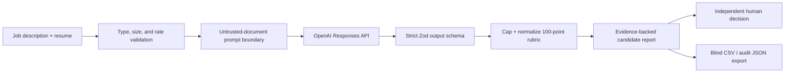

# Shortlist

**Every score comes with proof.**

Shortlist turns a job description and a batch of resumes into an evidence-backed ranking without letting AI make the hiring decision. It was built solo for the **48-Hour Solo AI Builder / Full-Stack AI Engineer challenge**.

The public experience is populated immediately with a clearly labeled fictional evaluation—no account, setup, or real candidate data required. With one server-side API key, a reviewer can also batch-screen real PDF, TXT, or Markdown resumes.

## Live demo

[Open the production deployment](https://shortlist-ai-proof.vercel.app). It is intentionally usable in seeded-demo mode before the `OPENAI_API_KEY` production secret is configured; real resume screening becomes available immediately after that server-only secret is set.

## What makes this more than an API demo

- **Evidence-backed scoring:** every rubric category points to resume evidence; absent evidence scores conservatively.
- **One explicit 100-point rubric:** skills 30, relevant experience 20, demonstrated impact 20, ownership 15, role context 10, communication 5.
- **Strict AI contract:** OpenAI Responses API output is validated by Zod, capped by category, normalized, and ranked deterministically.
- **Prompt-injection boundary:** resume contents are untrusted data and cannot change the screening rules.
- **Fairness by design:** protected attributes are excluded, names are hidden by default, and pedigree alone earns no credit.
- **Human agency:** the AI recommendation and the human advance/hold/decline decision are separate states.
- **Zero server retention:** this application does not store raw resumes or assessment results server-side.
- **Reviewable operations:** model, prompt version, latency, token usage, confidence, and request ID travel with each live assessment.
- **Reviewer-friendly demo:** fictional candidates, responsive UI, CSV/JSON export, and no authentication wall.

## Product flow



## Stack

- Next.js 16 App Router, React 19, TypeScript
- Next.js Route Handlers as the backend-for-frontend
- OpenAI JavaScript SDK and Responses API structured output
- Zod for request and model-output contracts
- Custom responsive CSS and Lucide icons
- Vitest, ESLint, and TypeScript checks
- Vercel-compatible runtime; no persistent infrastructure on the critical path

The model is environment-configurable. `gpt-5.4-mini` is the checked-in default because resume assessment is a well-defined, structured, high-volume task where latency and cost matter. See the current [OpenAI model catalog](https://developers.openai.com/api/docs/models) and [model comparison](https://developers.openai.com/api/docs/models/compare).

## Run locally

Requirements: Node.js 22+ and an OpenAI API key for live screening.

```bash
npm ci
copy .env.example .env.local
npm run dev
```

Set the server-only values in `.env.local`:

```dotenv
OPENAI_API_KEY=your_server_only_key
OPENAI_MODEL=gpt-5.4-mini
```

Open `http://localhost:3000`. Without a key, the complete fictional evaluation remains available and the upload dialog explains why live screening is disabled.

## Quality commands

```bash
npm run lint
npm run typecheck
npm test
npm run build
```

Current verified result:

- ESLint: pass
- TypeScript: pass
- Vitest: 15/15 tests pass
- Production build: pass
- Production dependency audit: 0 known vulnerabilities
- Browser QA: desktop and 390 px mobile pass with no console warnings/errors

## API

### `GET /api/health`

Returns readiness without exposing secrets: AI configuration status, model, prompt version, accepted formats, limits, and retention mode.

### `POST /api/screen`

Accepts one resume per call. The browser coordinates up to five candidates with concurrency limited to two.

```json
{
  "job": {
    "title": "Solo AI Builder",
    "description": "At least 80 characters of role context..."
  },
  "resume": {
    "fileName": "candidate.pdf",
    "mimeType": "application/pdf",
    "dataUrl": "data:application/pdf;base64,..."
  }
}
```

Guardrails include a 5 MB file limit, supported-type allowlist, best-effort per-IP rate limiting, 50-second provider timeout, one provider retry, strict response schema, score normalization, safe error messages, and `Cache-Control: no-store`.

## Important product boundaries

This is **decision support**, not an autonomous hiring system. It must not reject candidates, send messages, or make employment decisions without a human. LLM output can still be wrong; the evidence, confidence, and interview questions exist so a reviewer can validate rather than trust blindly.

The public challenge build intentionally has no authentication or database. That removes reviewer friction and avoids retaining candidate PII. The production extension would add Supabase Auth, Postgres with row-level security, private Storage, organization-scoped audit records, explicit deletion controls, and a background queue only after real usage proves those needs.

## Repository guide

- [`docs/48-HOUR-PLAN.md`](docs/48-HOUR-PLAN.md) — hour-by-hour execution, gates, risks, evals, and submission plan.
- [`docs/ARCHITECTURE.md`](docs/ARCHITECTURE.md) — data flow, trust boundaries, decisions, and production extension.
- [`docs/APPLICATION.md`](docs/APPLICATION.md) — ready-to-send challenge answer and 90-second demo script.
- [`app/api/screen/route.ts`](app/api/screen/route.ts) — secure screening route and model orchestration.
- [`lib/assessment.ts`](lib/assessment.ts) — schemas, normalization, thresholds, and privacy helpers.
- [`tests/`](tests/) — score-boundary, normalization, redaction, payload, export, and CSV-injection tests.

## Why no Supabase in the first deploy?

Because the first user is a time-poor reviewer, not a multi-tenant recruiting team. A database would add authentication, policies, migrations, and PII retention before validating the central value: **is the ranking clear, grounded, and useful?** The design leaves a clean persistence seam, but shipping the useful vertical slice first is the more pragmatic engineering decision.

## License and data

The seeded candidates are fictional and exist only to demonstrate behavior. Do not upload a real resume unless you have permission to process it with the configured AI provider.
