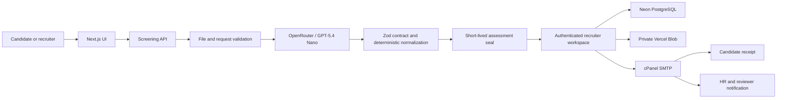

# Shortlist

**Evidence-backed AI resume screening for human hiring teams.**

[Live product](https://ats.mehdisharifi.com) · [48-hour plan](docs/48-HOUR-PLAN.md) · [Application brief](docs/APPLICATION.md) · [Architecture](docs/ARCHITECTURE.md)

Try the real database-backed [Free and Pro demo accounts](docs/DEMO-ACCOUNTS.md) from the [login page](https://ats.mehdisharifi.com/login). The documented credentials expose genuine plan entitlements; outbound email is disabled for public-account safety.

Shortlist is a production-minded applicant tracking system built for the Solo AI Builder 48-hour challenge. It screens a resume against a canonical job description, separates parse quality from job fit, grounds every score in candidate evidence, and moves the result into an authenticated recruiter pipeline. AI recommends; a human decides.

## Product proof

- Challenge-ready core delivered in **47 hours 59 minutes**.
- Current `v1.2.0` production extension delivered in **70 hours 48 minutes**.
- **60 automated tests** across 13 suites.
- Deployed on Vercel Hobby at a custom TLS domain.
- Built solo across product, UX, frontend, APIs, AI orchestration, database, storage, email, security, tests, and operations.

## Shipped capabilities

### Screening and evidence

- PDF, DOCX, TXT, and Markdown resume validation.
- OpenRouter integration using `openai/gpt-5.4-nano` by default.
- Strict Zod assessment contract and deterministic score normalization.
- Six explicit scoring dimensions, evidence excerpts, must-haves, gaps, risks, confidence, limitations, and interview questions.
- Parse quality kept separate from role fit.
- Prompt-injection boundary and protected-attribute exclusions.

### Recruiter workspace

- Authenticated, organization-scoped position pipelines.
- Free/pro plan rules and capability-based roles.
- Candidate search, comparison, stage movement, human decisions, and audit events.
- Retry-safe sealed assessment intake tied to the canonical position description.
- Private resume storage and side-by-side PDF plus ATS review.
- Controlled candidate and position archive; protected challenge position and showcase candidate.

### Communication and collaboration

- Candidate application-received email after successful screened intake.
- HR and selected-reviewer notifications with a reviewer-directory dropdown.
- Recipient allowlists, safe templates, idempotency keys, outbox leases, and visible delivery failures.
- Signed private review links, immutable feedback, reminders, and expiry cleanup.

### Production controls

- Same-origin and content-type checks, CSRF protection, opaque sessions, role capabilities, and safe errors.
- File signature/size/page/encryption checks and bounded request budgets.
- Rate limits, request IDs, no-store responses, security headers, and logs that omit resume content.
- Neon PostgreSQL, private Vercel Blob, authenticated cPanel SMTP, and Vercel Hobby deployment.

## Architecture



The model cannot directly write hiring records. The server validates and normalizes the result, seals it against the canonical job description, and verifies that seal before persistence. Employment decisions remain separate human actions.

## Stack

| Layer | Technology |
| --- | --- |
| Full stack | Next.js 16, React 19, TypeScript 6 |
| AI | OpenRouter, `openai/gpt-5.4-nano`, OpenAI-compatible SDK, Zod |
| Data | Neon PostgreSQL (`pg`) |
| Files | Private Vercel Blob |
| Email | Nodemailer and authenticated cPanel SMTP |
| UI | Manrope, Lucide, Framer Motion, responsive custom CSS |
| Quality | Vitest, ESLint, TypeScript, Next production build |
| Delivery | Vercel Hobby, Cloudflare DNS, custom domain |

## Local development

Requirements: Node.js 20.9 or newer and a PostgreSQL database for the durable workspace.

```bash
npm ci
copy .env.example .env.local
npm run db:migrate
npm run db:bootstrap
npm run dev
```

Never commit `.env.local`, provider keys, database credentials, SMTP passwords, real resumes, or candidate exports.

## Quality gate

```bash
npm run quality
```

This runs lint, TypeScript, 60 tests, and the production build. Pull requests use the same gate in GitHub Actions.

## Environment contract

The checked-in [`.env.example`](.env.example) documents supported variables. Production uses server-only values for:

- OpenRouter or OpenAI-compatible provider configuration;
- Neon PostgreSQL;
- session, CSRF, assessment-seal, and review-link secrets;
- private Vercel Blob access;
- authenticated SMTP and notification recipient policy.

Do not use `NEXT_PUBLIC_` for any credential.

## Repository workflow

- `main` is production-ready.
- `codex/develop` integrates reviewed work.
- `codex/feature/*` contains one bounded change.
- `codex/release/*` prepares a tagged release.

Every pull request must explain scope, risk, verification, screenshots when UI changes, and rollback. See [CONTRIBUTING.md](CONTRIBUTING.md).

## Privacy and hiring boundary

Resumes contain sensitive personal data. Only process material you are authorized to handle. Screening is decision support and can be wrong; evidence, uncertainty, and human approval are product requirements, not decorative disclaimers. See [SECURITY.md](SECURITY.md) for responsible disclosure.

## License and demo data

The showcase data is either fictional or explicitly protected portfolio material. Do not commit real applicant data. No open-source license is granted unless a license file is added.
