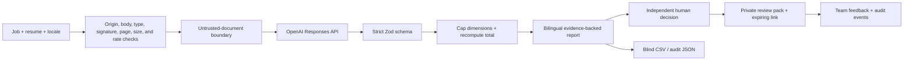

# Shortlist

**Every score comes with proof. | هر امتیاز با مدرک همراه است.**

Shortlist turns a job description and up to five resumes into an evidence-backed ranking without letting AI make the hiring decision. It was built solo for the **48-Hour Solo AI Builder / Full-Stack AI Engineer challenge** and is fully usable in English and Persian, including right-to-left layouts and Persian analytical output.

Shortlist یک شرح شغل و حداکثر پنج رزومه را به رتبه‌بندی مستند تبدیل می‌کند؛ تصمیم نهایی استخدام همیشه در اختیار انسان می‌ماند. رابط کاربری، داده نمایشی و گزارش تحلیلی به‌صورت کامل از فارسی و انگلیسی پشتیبانی می‌کنند.

## Live product

[Open the production deployment](https://shortlist-ai-proof.vercel.app)

The public URL opens on a clearly labeled fictional evaluation with no account, setup, or real candidate data. Live PDF, DOCX, TXT, and Markdown screening becomes available when the server-only `OPENAI_API_KEY` secret is configured; the seeded product tour remains complete when it is not. The cPanel release adds an authenticated recruiter workspace at `/workspace`.

## Why this is more than an API demo

- **Evidence-backed scoring:** every rubric dimension contains a rationale and resume evidence; missing evidence stays missing.
- **Explicit 100-point contract:** skills 30, relevant experience 20, demonstrated impact 20, ownership 15, role context 10, communication 5.
- **Strict AI boundary:** OpenAI Responses API output is validated with Zod, capped per category, normalized, and ranked deterministically.
- **Prompt-injection resistance:** resumes are untrusted documents and cannot change the system rules.
- **Fairness and human agency:** protected characteristics are excluded, blind review is available, and AI recommendation is separate from advance/hold/decline.
- **Bilingual by construction:** request-aware EN/FA rendering, correct LTR/RTL direction, localized numbers and exports, Persian search normalization, and original-language evidence preservation.
- **Two honest product modes:** a no-login public challenge demo and an authenticated, organization-scoped cPanel workspace backed by MySQL/MariaDB.
- **Position-based operations:** job ads, pipeline stages, sealed assessment intake, optimistic stage moves, team roles, bilingual templates, controlled automations, and append-only audit events.
- **Selective, consented persistence:** public screening stays ephemeral; HR can create expiring review packs in Vercel Blob or an AES-256-GCM encrypted cPanel filesystem and optionally attach the original résumé.
- **Team workflow:** signed review links, bilingual cPanel SMTP, exact reviewer allowlists, human-confirmed candidate messages, immutable feedback, outbox idempotency/leases, and daily reminders.
- **Operational evidence:** model, prompt version, latency, token usage, confidence, request ID, and rate-limit behavior remain visible and reviewable.
- **Production-shaped UX:** fictional first paint, responsive dashboard, accessible dialogs/drawers, CSV/JSON export, error recovery, and no authentication wall.

## Product flow



## Stack

- Next.js 16.2 App Router, React 19.2, and TypeScript 6
- Next.js Node.js Route Handlers as the backend-for-frontend
- OpenAI JavaScript SDK 6 and Responses API structured output
- Zod 4 for request and model-output contracts
- `pdf-lib` for PDF integrity, encryption, and page-budget checks
- Self-hosted variable Manrope and Vazirmatn fonts, custom responsive CSS, and Lucide icons
- Framer Motion with reduced-motion support for restrained workspace transitions
- Atomic MySQL rate limits on cPanel or Upstash Redis REST on serverless, with a bounded development/demo fallback
- `mysql2`, bcrypt, opaque hashed sessions, CSRF protection, capability-based RBAC, composite tenant constraints, idempotent commands, and append-only audit records
- Private Vercel Blob review packs or AES-256-GCM encrypted cPanel filesystem packs with HMAC-signed expiring links
- Nodemailer with optional cPanel SMTP, an exact recipient allowlist, and a daily Hobby-compatible Vercel Cron
- Vitest, ESLint, TypeScript, production builds, dependency audit, and browser QA
- Vercel Hobby for the public portfolio and a Next.js standalone artifact for cPanel/Passenger/LiteSpeed

The checked-in default model is the current `gpt-5.6` alias and can be changed with `OPENAI_MODEL`. The prompt contract is versioned independently as `screen-v2.1.0`. For a long-lived production system, evaluate bilingual fixtures first and then pin a dated model snapshot for reproducibility.

## Run locally

Requirements: Node.js `>=20.9.0`. An OpenAI API key is required only for live screening.

```powershell
npm ci
Copy-Item .env.example .env.local
npm run dev
```

Set server-only values in `.env.local`:

```dotenv
OPENAI_API_KEY=your_server_only_key
OPENAI_MODEL=gpt-5.6

# Optional: globally consistent limits across serverless instances
UPSTASH_REDIS_REST_URL=
UPSTASH_REDIS_REST_TOKEN=

# Private team review
BLOB_READ_WRITE_TOKEN=provided-by-vercel
REVIEW_LINK_SECRET=at-least-32-random-bytes
CRON_SECRET=another-random-secret
APP_URL=https://shortlist-ai-proof.vercel.app

# Optional cPanel SMTP
SMTP_HOST=mail.example.com
SMTP_PORT=465
SMTP_SECURE=true
SMTP_USER=reviews@example.com
SMTP_PASSWORD=<mailbox-password-set-only-in-the-host-control-panel>
EMAIL_FROM="Shortlist <reviews@example.com>"
REVIEW_ALLOWED_RECIPIENTS=manager@example.com,lead@example.com
```

Open `http://localhost:3000`. Without a key, the fictional evaluation remains available and the upload dialog explains that live AI is disabled.

## Quality commands

```bash
npm run quality
npm audit --omit=dev
```

The quality pipeline runs ESLint, TypeScript, 49 Vitest tests, and a production build. The verified browser matrix includes English and Persian at desktop and 390 px mobile widths, keyboard focus behavior, dialogs and the mobile drawer, RTL layout, readable font sizes and touch targets, horizontal overflow, and browser console errors.

## API

### `GET /api/health`

Returns readiness without exposing secrets: AI configuration status, model, prompt version, accepted formats, 3 MiB / 120,000-text-character / five-file / ten-page limits, app storage mode, provider-policy reminder, and active rate-limit backend.

### `POST /api/screen`

Accepts one resume per call. The browser coordinates a batch of up to five with concurrency limited to two.

```json
{
  "locale": "fa",
  "job": {
    "title": "Solo AI Builder",
    "description": "At least 80 characters of role context..."
  },
  "resume": {
    "fileName": "candidate.pdf",
    "mimeType": "application/pdf",
    "dataUrl": "data:application/pdf;base64,..."
  }
}
```

Server guardrails include same-origin and JSON checks, a 4.4 MB request ceiling, a 3 MiB decoded-file limit, a visible 120,000-character text ceiling, extension/MIME/data-URL matching, canonical Base64, PDF signature and EOF checks, rejection of malformed or encrypted PDFs, a maximum of 10 PDF pages, strict UTF-8 text handling, contact redaction for text resumes, an 8-request/minute and 60-request/day client limit, a fail-closed distributed spend guard for paid production calls, a 75-second provider timeout with no automatic retry, strict response validation, deterministic score normalization, stable localized error codes, request IDs, safe no-PII logs, and `Cache-Control: no-store`.

The 3 MiB raw limit is intentional: Base64 expands a file by roughly one third, so it keeps the JSON request below Vercel Functions' 4.5 MB request-body limit after metadata and encoding overhead.

### `POST /api/reviews`

Creates an explicit, expiring private team-review pack. Requests are same-origin, rate-limited, schema-bounded, and can optionally include a 3 MiB PDF/DOCX/TXT/MD résumé when blind mode is off. Email recipients must match `REVIEW_ALLOWED_RECIPIENTS`; without SMTP the secure copyable link still works.

### `POST /api/reviews/feedback`

Validates the signed review token and stores each reviewer decision/comment as a separate immutable Blob event. A configured HR notification address receives a delivery notice; feedback never changes the AI score.

### `GET /api/cron/review-reminders`

Runs once daily on Vercel Hobby, secured by `CRON_SECRET`. It sends reminders only for review packs older than 24 hours with no feedback, records each reminder as an audit event, and deletes expired packs and resume objects.

## Privacy and provider boundary

Screening remains ephemeral: Shortlist processes a file in memory for one request and sets `store: false` for the model call. Persistence happens only after an HR user explicitly chooses “Share with hiring team.” The resulting assessment pack, optional resume, and feedback events live in a private Vercel Blob store; signed access links expire after 24, 48, or 72 hours.

That setting does **not** replace the provider account's data controls. Under OpenAI's default API data controls, abuse-monitoring logs may retain content for up to 30 days unless the organization has approved and configured Modified Abuse Monitoring or Zero Data Retention. Only process real resumes with permission and with provider settings, contracts, region, and retention suitable for the organization.

This product is decision support, not an autonomous hiring system. It must not reject candidates, contact them, or make employment decisions without human review. LLM output can be wrong; evidence, confidence, limitations, and interview questions exist so a reviewer can validate it rather than trust it blindly.

## Security and accessibility

- Server-only secrets; no `NEXT_PUBLIC_` key path.
- Content Security Policy, HSTS, frame denial, MIME sniffing protection, restricted permissions, same-origin opener/resource policies, and no framework disclosure header.
- Sanitized Unicode filenames, bidirectional-control stripping, content signature validation, request/body caps, safe errors, anonymized HMAC rate keys, and no PII in application logs.
- Persistent EN/FA preference, semantic direction switching, ARIA names and selected/pressed states, modal and drawer focus traps, Escape/backdrop dismissal, focus restoration, background inertness, visible focus rings, 44 px mobile targets, and responsive no-overflow layouts.
- Manrope for English and Vazirmatn for Persian are bundled with the application, avoiding third-party font requests.

## cPanel production mode

When MySQL and `SESSION_SECRET` are configured, `/workspace` becomes a private recruiter product instead of the read-only portfolio workspace. A live résumé can be screened against the selected canonical job ad; the server returns a short-lived HMAC seal, and only a matching, unmodified result can enter that position's database pipeline. The original résumé remains ephemeral in this intake.

The cPanel deployment uses MySQL for durable rate limiting, so it does not require Upstash. Candidate email requires an authenticated recruiter, a canonical candidate address, an active restricted-variable template, explicit human approval, an idempotency key, and a claimed outbox lease. Adverse actions are never triggered automatically.

## Repository guide

- [`docs/48-HOUR-PLAN.md`](docs/48-HOUR-PLAN.md) — hour-by-hour execution, gates, risks, evaluation, and submission plan.
- [`docs/ARCHITECTURE.md`](docs/ARCHITECTURE.md) — data flow, trust boundaries, current controls, and scale-out design.
- [`docs/APPLICATION.md`](docs/APPLICATION.md) — ready-to-send challenge answer and 90-second demo script.
- [`docs/CPANEL-DEPLOYMENT.md`](docs/CPANEL-DEPLOYMENT.md) — exact Cloudflare DNS, cPanel Node, MySQL/phpMyAdmin, SMTP, backup, smoke-test, and rollback runbook.
- [`app/api/screen/route.ts`](app/api/screen/route.ts) — screening route and model orchestration.
- [`lib/assessment.ts`](lib/assessment.ts) — schemas, prompt version, normalization, thresholds, and privacy helpers.
- [`tests/`](tests/) — assessment, export, file validation, rate limiting, i18n, and security regression tests.

## License and data

Seeded candidates are fictional and exist only to demonstrate behavior. Do not upload a real resume unless you have permission to process it with the configured AI provider.
