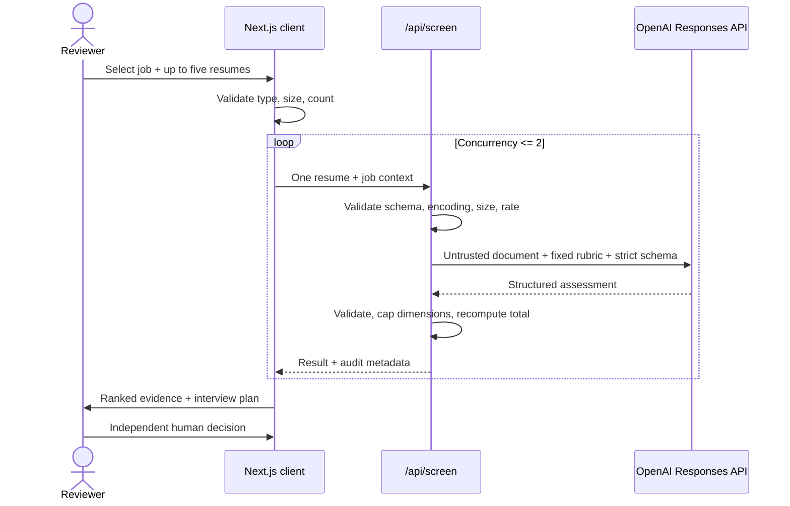

# Architecture and decision record

## System shape

Shortlist is a stateless full-stack Next.js application. The dashboard is statically rendered; health and screening run in Node.js route handlers. Candidate files enter through the browser, are processed in memory for one request, and are not written by this application.

## Trust boundaries

### Browser

- Validates batch count, supported extension/MIME, and 5 MB size.
- Stores only current in-memory application state.
- Never receives `OPENAI_API_KEY`.
- Can export an identity-hidden CSV or audit JSON.

### Screening route

- Revalidates every input; client checks are never trusted.
- Matches declared MIME type to the data URL and estimates decoded size.
- Applies a best-effort 12-request/minute instance-local limit.
- Redacts email, phone, and links from text resumes before provider submission.
- Sends PDF files directly as model input; the prompt forbids protected-signal use.
- Uses `store: false`, no response cache, minimal safe logs, timeout, and retry bounds.

### Model boundary

- Resume text is explicitly untrusted and cannot provide instructions.
- Model output must match a strict Zod schema.
- The model cannot decide the final score total: the server caps each category and recomputes it.
- Recommendation thresholds are deterministic code, not model prose.
- A refusal or malformed response becomes a retryable error, never a partial report.

## Failure behavior

| Failure | User outcome | Data behavior |
| --- | --- | --- |
| Key absent | Seeded evaluation works; live action disabled with explanation | No file transmitted |
| Invalid/large file | Actionable client and server error | No model call |
| Rate limited | Retry-after guidance | No model call |
| Provider auth/outage | Safe generic error + request ID | No app persistence |
| Refusal/schema failure | No partial score; retryable error | No app persistence |
| UI exception | Error boundary and reset path | No app persistence |

## Why direct PDF input?

It removes a second parsing service and keeps the critical path small. Text and Markdown are decoded and contact-redacted locally on the server. A production system with scanned or complex resumes would add an isolated OCR/parser pipeline, file-content sniffing, malware scanning, and a private short-lived object store.

## Why ephemeral state?

The challenge's first user needs to evaluate product judgment quickly. An account wall would reduce completion; persistence would create PII duties before it creates user value. Ephemeral state is the simplest behavior that supports the complete reviewer journey.

## Production extension after validation

1. **Supabase Auth:** magic-link and SSO, organization membership, role-based controls.
2. **Postgres:** jobs, rubric versions, candidates, assessments, evidence, human decisions, and immutable audit events.
3. **Row-level security:** every table scoped through organization membership; service-role use only in trusted server routes.
4. **Private Storage:** encrypted resumes with short signed URLs, retention dates, and explicit delete/export controls.
5. **Queue:** per-candidate jobs, idempotency keys, bounded retries, dead-letter state, and live progress.
6. **Evaluation:** versioned golden set, ranking agreement, evidence-grounding checks, subgroup quality audits, and prompt/model canaries.
7. **Observability:** structured no-PII logs, request traces, latency/cost dashboards, provider errors, and alerting.
8. **Policy:** consent, retention configuration, regional processing, access logs, and an appeals/review workflow.

## Known limitations

- No OCR for image-only PDFs.
- No durable rate limiting across server instances.
- No malware scanning or file-content sniffing beyond the declared data URL.
- No durable candidate state, teams, or organization permissions.
- A language model can still miss or misinterpret evidence; the interface is designed for validation, not blind trust.

