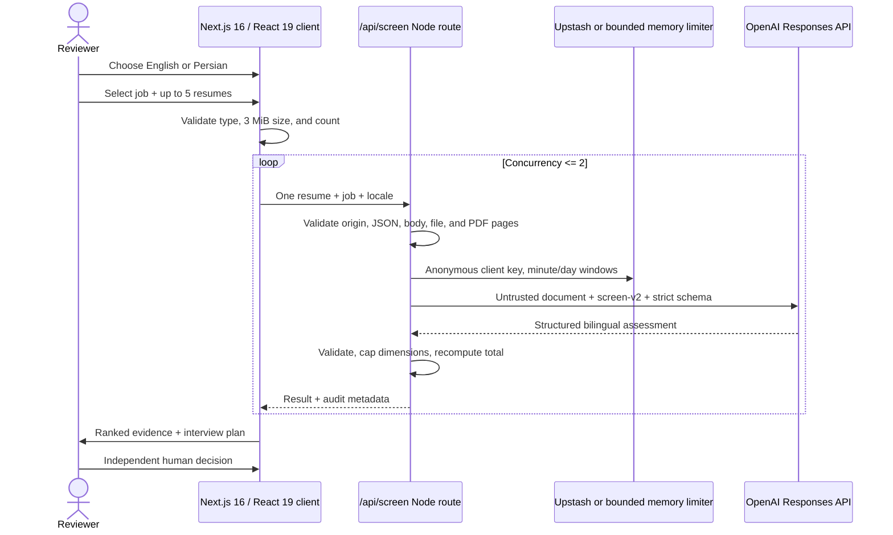

# Architecture and decision record

## System shape

Shortlist is a request-aware, stateless full-stack Next.js 16 application. The server renders the locale-aware shell; interactive reviewer state lives in React; health and screening run in Node.js Route Handlers. Candidate files are processed in memory for one request and are not written to application-owned storage.

## Runtime and contracts

| Layer | Current implementation |
| --- | --- |
| Web | Next.js 16.2 App Router, React 19.2, TypeScript 6 |
| AI | OpenAI Responses API, `gpt-5.6` by default, `OPENAI_MODEL` override |
| Prompt | `screen-v2.0.0`, versioned separately from the model |
| Validation | Zod request/output schemas plus independent file and PDF validation |
| File budget | 3 MiB decoded file, 120,000 text characters, 5 resumes per browser batch, 10 pages per PDF |
| Function budget | 4.4 MB application ceiling beneath Vercel's 4.5 MB body limit; 90-second function, 75-second provider timeout |
| Rate limit | 8 requests/minute and 60/day per anonymized client; Upstash REST required for paid production calls, bounded in-memory fallback for development/no-key demo |
| Persistence | Candidate files and reports are session-only; no application database or object store |
| Languages | English and Persian UI/output, LTR/RTL, localized digits/exports, original-language evidence |

The raw-file cap is smaller than the transport limit because Base64 adds about 33% and the JSON envelope adds more bytes. For larger production uploads, the correct architecture is direct upload to private object storage followed by a short-lived server-side reference—not a larger Base64 request.

## Trust boundaries

### Browser

- Validates a maximum of five files, supported extension/MIME, and 3 MiB size before encoding.
- Sends one candidate per request with concurrency limited to two.
- Keeps candidate results and human decisions in the current application session only; locale preference is the only persisted preference.
- Never receives `OPENAI_API_KEY` or Upstash credentials.
- Exports identity-hidden CSV in blind mode and audit-oriented JSON.
- Uses localized stable API error codes rather than displaying provider internals.

### Screening route

- Requires same-origin browser requests and `application/json`, and rejects declared bodies over 4.4 MB.
- Revalidates the request with Zod; client checks are never trusted.
- Sanitizes Unicode filenames and removes path, control, and bidirectional-override characters.
- Matches extension, declared MIME, and data-URL MIME; requires canonical Base64 and enforces decoded size.
- Checks PDF header/trailer, parseability, encryption state, and a 1–10 page budget. TXT/MD must be strict UTF-8 and non-binary.
- Redacts email, phone, and links from text resumes before provider submission. PDF content is submitted directly, so consent and provider policy remain required.
- Applies minute and daily fixed windows using HMAC-anonymized client keys. Upstash makes enforcement consistent across instances and paid production requests fail closed if it is unavailable; a bounded 5,000-key memory map serves demos/development.
- Uses a 75-second provider timeout, no automatic provider retry, a 90-second function budget, `store: false`, `safety_identifier`, no response caching, and structured logs that omit resume content and identifiers.

### Model boundary

- Resume content is explicitly untrusted and cannot supply instructions, change the rubric, trigger tools, or request prompt disclosure.
- Protected and highly sensitive attributes cannot influence or appear in the analysis.
- Output must match a strict Zod schema. Persian requests produce professional Persian analysis while exact evidence remains in its source language.
- The model cannot decide the final total: server code caps each dimension and recomputes 100 points.
- Recommendation thresholds are deterministic code, not model prose, and remain separate from the reviewer's decision.
- Refusal, malformed output, timeout, or provider failure becomes a safe error with a request ID—never a partial assessment.

### Provider boundary

Shortlist does not persist resumes or assessments and sets `store: false`, but the model provider is a separate data processor. OpenAI's default API controls may keep abuse-monitoring logs containing content for up to 30 days unless the account is approved and configured for Modified Abuse Monitoring or Zero Data Retention. Deployment owners must align consent, account controls, contracts, region, and retention before processing real candidates.

## Failure behavior

| Failure | User outcome | Data behavior |
| --- | --- | --- |
| API key absent | Seeded evaluation works; live action explains configuration | No file sent to the provider |
| Cross-origin, wrong media type, or oversized body | Stable localized error | No parse/model call |
| Unsupported, spoofed, malformed, encrypted, large, or long file | Actionable per-file error | No model call |
| Minute/day limit reached | Retry guidance and standard rate headers | No model call |
| Upstash unavailable | Paid production call fails closed; development/no-key demo uses bounded fallback | No client identifier logged |
| Provider auth, rate, timeout, or outage | Safe generic error + request ID | No application persistence |
| Refusal or schema failure | No partial score; retryable result | No application persistence |
| UI exception | Localized error boundary and reset path | No application persistence |

## Security headers and browser isolation

Every route receives a Content Security Policy, HSTS, `X-Content-Type-Options: nosniff`, frame denial, strict referrer policy, same-origin opener and resource policies, an origin-agent cluster, and a restricted Permissions Policy. Framework disclosure is disabled. Application responses and screening errors are `no-store`.

## Accessibility and internationalization

- Locale is resolved on the server from a cookie and synchronized in the browser; `<html lang>` and `dir` update correctly.
- Manrope and Vazirmatn variable fonts are bundled locally. CSS uses logical properties so the dashboard, details, filters, and icons adapt to RTL.
- English/Persian copy includes metadata, demo analysis, errors, status labels, exports, ARIA names, durations, and numbers. Search normalizes Persian/Arabic keyboard variants.
- Dialogs and the mobile candidate drawer trap focus, restore it on close, support Escape/backdrop dismissal, lock scrolling, and make background regions inert.
- Interactive targets are at least 44 px on mobile, focus rings remain visible, and the verified 390 px view has no horizontal overflow.

## Why ephemeral state?

The challenge's first user needs to evaluate product judgment quickly. An account wall reduces completion, while durable resumes create authorization, deletion, breach-response, and retention duties before they create user value. A complete session-only vertical slice proves the central thesis—whether evidence-backed ranking is useful—while retaining a clear persistence seam.

## Production extension after validation

1. **Identity:** Supabase Auth with magic link/SSO, organization membership, and role-based controls.
2. **Persistence:** organization-scoped Postgres entities for jobs, rubric/prompt/model versions, candidates, assessments, human decisions, and immutable audit events.
3. **Authorization:** row-level security on every table; service-role access only in trusted server jobs.
4. **Files:** direct encrypted uploads to private Storage, malware/OCR pipeline, short signed URLs, explicit retention dates, and delete/export controls.
5. **Work queue:** idempotent per-candidate jobs, bounded retries, dead-letter state, cancellation, and live progress.
6. **Rate and abuse control:** required Upstash, organization/user quotas, spend budgets, and anomaly alerts.
7. **Evaluation:** versioned bilingual golden sets, ranking agreement, evidence-grounding checks, subgroup quality audits, and prompt/model canaries before snapshot changes.
8. **Observability:** no-PII logs, distributed traces, SLOs, latency/cost dashboards, provider errors, and alerts.
9. **Policy:** consent capture, regional processing, configurable retention, access logs, human review, correction, and appeals workflows.

## Known limitations

- No OCR or malware scanner for image-only or hostile PDFs.
- Production live AI is enabled only when Upstash variables are configured; limiter outages fail closed.
- No durable candidate state, user accounts, organization permissions, or audit ledger in the public challenge build.
- Direct Base64 transport intentionally caps raw files at 3 MiB and PDFs at 10 pages.
- Text-contact redaction is best-effort; direct PDF input may still contain PII.
- A language model can miss or misinterpret evidence. The interface supports validation; it does not justify blind trust or automated employment decisions.
